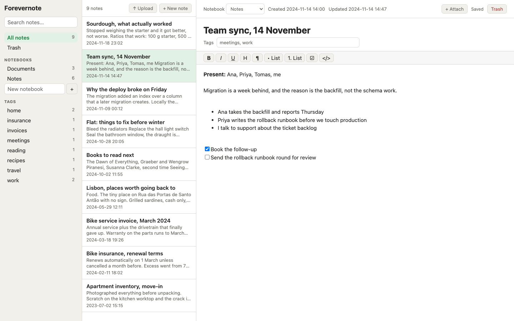
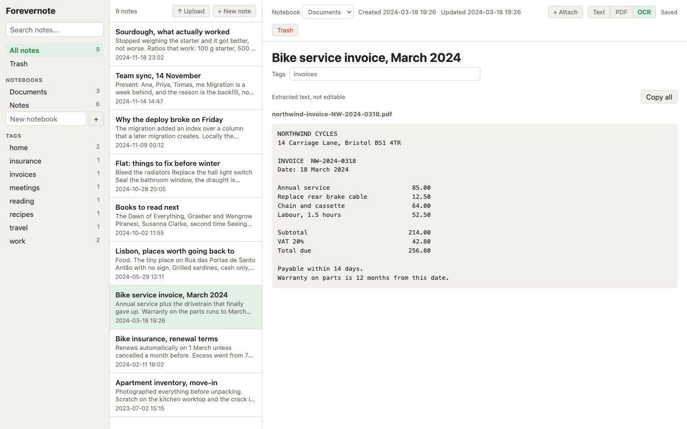

# Forevernote

> **No authentication.** Anyone who can reach the port can read, edit and upload.
> Run it on a trusted network only.

A small, local, editable notes app that takes an Evernote export and makes it yours
again. Single SQLite file, full-text search that reaches inside scanned documents,
notebooks, tags, attachments with inline PDF viewing. No accounts, no cloud, no
telemetry.

The interesting part is what happens to scans. Evernote's server-side OCR does not
come with your export, so Forevernote rebuilds it locally: PDF text layers are read
directly, and anything else is transcribed by a vision model running on your own
machine. Drop a file in and it becomes a note that is titled, tagged and searchable a
few seconds later.

Everything runs on hardware you control. Nothing is sent anywhere.



## Try it without an export

```sh
npm install
npm run demo                              # writes data/demo.db with invented notes
FOREVERNOTE_DB=data/demo.db npm run dev   # http://localhost:5173
```

The demo includes an attached invoice whose text has already been extracted, so
searching for `warranty` finds a document by its contents rather than its name.

## Status

Works, and is in daily use by its author. The server code is well covered by tests;
the Svelte components are not. Expect rough edges, and read
[DEVLOG.md](DEVLOG.md) before changing anything subtle.

## Requirements

- **Node 24 or newer.** Uses the built-in `node:sqlite`, so there is no native build
  step. The bundled SQLite must have FTS5, which it does on official builds.
- **poppler-utils** (`pdfinfo`, `pdftotext`, `pdftoppm`) for reading and rasterising
  PDF pages. Optional if you never touch PDFs.
- **An OpenAI-compatible server with a vision model**, for transcribing scans.
  [llama.cpp](https://github.com/ggml-org/llama.cpp)'s `llama-server` and
  [Lemonade](https://lemonade-server.ai) both work. Optional: without it, text layers
  still get read and everything else is stored but not transcribed.
- **macOS only, optional:** `tools/ocr.swift` uses PDFKit and Vision for local bulk
  work. The server path does not need it.

## Getting your data out of Evernote

Evernote Web cannot export notebooks, and the desktop app only does one at a time.
[evernote-backup](https://github.com/vzhd1701/evernote-backup) is easier and needs no
developer token:

```sh
evernote-backup init-db --oauth
evernote-backup sync
evernote-backup export ./export      # one .enex per notebook
```

The importer takes the notebook name from the file name, because ENEX does not record
it.

## Running

```sh
npm install
npm run import export/*.enex   # safe to re-run; skips notes already imported
npm run dev                    # http://localhost:5173
```

For production, `npm run build && npm start`.

To make scans searchable, point Forevernote at a vision model and run the extractor:

```sh
export FOREVERNOTE_LLM_URL=http://127.0.0.1:8080/v1
export FOREVERNOTE_LLM_MODEL=gemma-4-E4B-it-Q4_K_M.gguf
npm run ocr                    # idempotent; only processes what has no text yet
npm run ocr -- --upgrade       # redo anything previously done by weaker OCR
```

Extraction runs one page at a time. Budget roughly 25 seconds per page on an
integrated GPU, less on a discrete one.

## Configuration

| variable                | default                         | meaning                                                       |
| ----------------------- | ------------------------------- | ------------------------------------------------------------- |
| `FOREVERNOTE_DB`        | `data/forevernote.db`           | database location                                             |
| `FOREVERNOTE_LLM_URL`   | `http://127.0.0.1:13305/api/v1` | OpenAI-compatible endpoint                                    |
| `FOREVERNOTE_LLM_MODEL` | `Gemma-4-26B-A4B-it-GGUF`       | model name to request                                         |
| `PORT`, `HOST`          | `3000`, `0.0.0.0`               | where the server listens                                      |
| `BODY_SIZE_LIMIT`       | `512K`                          | max upload size; raise it or large scans fail with a bare 413 |

Behind a reverse proxy also set `PROTOCOL_HEADER=x-forwarded-proto`,
`HOST_HEADER=x-forwarded-host` and `XFF_DEPTH=1`.

## Using it

Search covers titles, note bodies and the text extracted from attachments, ranked by
relevance rather than date.

**Adding things.** Drop a file anywhere in the window, or use **Upload** above the note
list. Each file becomes its own note. Text files become the note body; everything else
is attached, with images inline. PDFs and images are queued for extraction, then the
model gives the note a title and tags. It is shown the existing tags and notebooks so
it reuses your vocabulary instead of inventing a near-duplicate each time.

The note opens immediately under a filename-derived title. The real title and tags
appear a few seconds later without a reload, and will not overwrite a field you have
already started editing.

**+ Attach** inside a note adds a file to an existing note instead, extracting its text
but leaving the title and tags alone.

**Reading what was extracted.** A note with attachments gets a Text / PDF / OCR toggle.
The OCR view shows exactly what the extractor read, which is what search matches against.



`/api/status` reports queue depth and whether poppler and the model server are
reachable.

## Deploying

`scripts/` holds deployment helpers for a Proxmox LXC behind a reverse proxy. They are
configured entirely through environment variables and will refuse to run until you set
them:

```sh
export FOREVERNOTE_SSH_HOST=root@your-proxmox-host
export FOREVERNOTE_CTID=126                 # app container
export FOREVERNOTE_LLM_CTID=107             # container running the model
export FOREVERNOTE_LLM_IP=10.0.0.5
export FOREVERNOTE_PUBLIC_URL=https://notes.example.com

npm run provision   # poppler, the model service and the app unit
npm run deploy      # build and push the app; never touches data
npm run backup      # pull the live database into backups/
```

If you deploy somewhere and then edit notes there, **that copy is your source of
truth**. `scripts/deploy.sh` never pushes data for this reason, and
`--replace-data` additionally requires `--force`, because it destroys anything created
on the server since your last backup.

These scripts encode one person's setup. Treat them as a worked example rather than a
general installer.

## Security

There is no authentication. Anyone who can reach the port can read, edit and upload.
Put it on a trusted network, or behind something that authenticates, and do not expose
it to the internet.

Attachments are served with `X-Content-Type-Options: nosniff`, and anything that is not
a PDF or a raster image additionally gets a `sandbox` Content-Security-Policy so it
cannot run as same-origin content. Uploads of HTML and SVG are refused outright.

## Layout

| path                                    | what                                        |
| --------------------------------------- | ------------------------------------------- |
| `src/lib/server/enex.ts`                | streaming ENEX parser                       |
| `src/lib/server/enml.ts`                | ENML to sanitised HTML and plain text       |
| `src/lib/server/db.ts`, `notes.ts`      | schema, migrations, repository, FTS5 search |
| `src/lib/server/jobs.ts`, `worker.ts`   | background queue and the worker draining it |
| `src/lib/server/pages.ts`, `poppler.ts` | splitting documents into pages              |
| `src/lib/server/llm.ts`, `classify.ts`  | model calls, titling and tagging            |
| `src/lib/server/intake.ts`              | turning an uploaded file into a note        |
| `src/routes/api/*`                      | JSON API                                    |
| `src/lib/components/*`                  | the three-pane UI                           |
| `scripts/demo.ts`                       | builds a demo database of invented notes    |
| `docs/ocr-benchmark.md`                 | how the model was chosen, and the numbers   |

`npm test` runs the tests, `npm run check` the type checker.

## Licence

Public domain, see [UNLICENSE](UNLICENSE).
